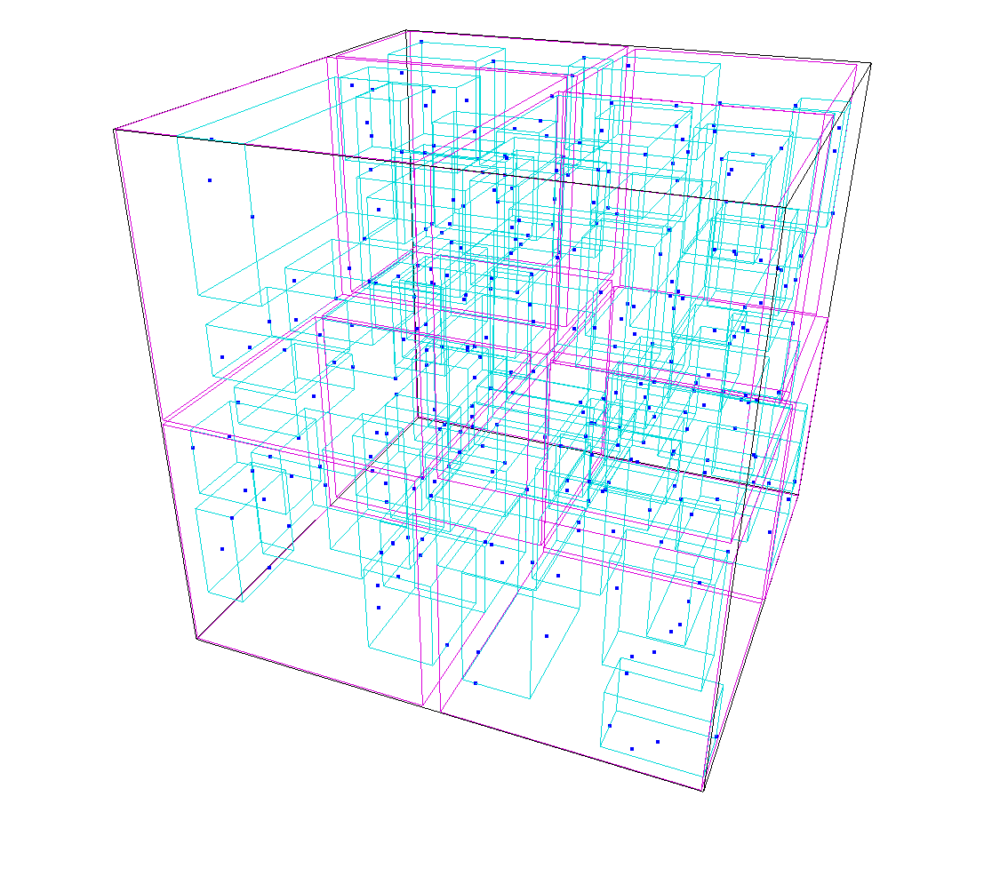

# rstar

A flexible, n-dimensional [r*-tree](https://en.wikipedia.org/wiki/R*_tree) implementation for the Rust ecosystem, suitable for use as a spatial index.

Please refer to the [crate README](rstar/README.md) for more information.

## r-tree

An r-tree is a data structure containing spatial data and is optimized for nearest neighbor search. Spatial data refers to an object that has the notion of a position and extent, for example points, lines and rectangles in any dimension.

## Geometries

Primitives are provided for point, line, and rectangle geometries. The [`geo`](https://crates.io/crates/geo) crate uses rstar as an efficient spatial index and provides [`RTreeObject`](file:///Users/sth/dev/rstar/target/doc/rstar/trait.RTreeObject.html) implementations for storing complex geometries such as linestrings and polygons.

# Demo
To run the rstar-demo, checkout the repository and run `cargo run rstar-demo` in the
repository root.

# License

Licensed under either of

 * Apache License, Version 2.0, ([LICENSE-APACHE](LICENSE-APACHE) or http://www.apache.org/licenses/LICENSE-2.0)
 * MIT license ([LICENSE-MIT](LICENSE-MIT) or http://opensource.org/licenses/MIT)

at your option.